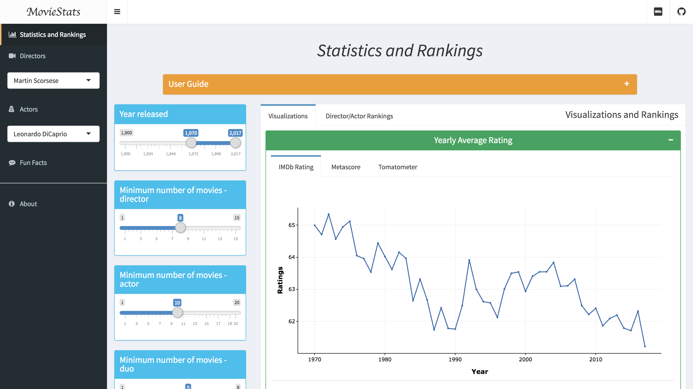
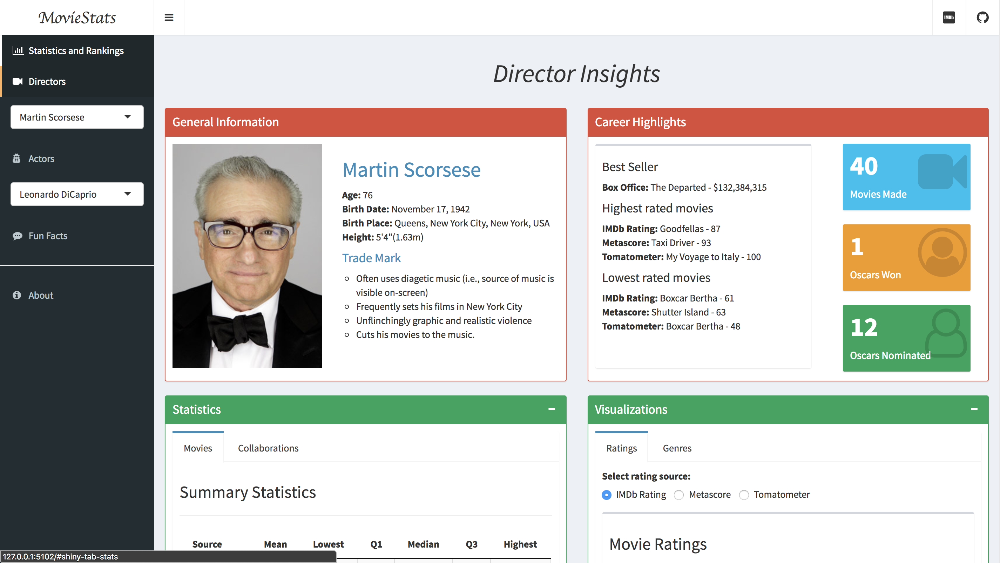
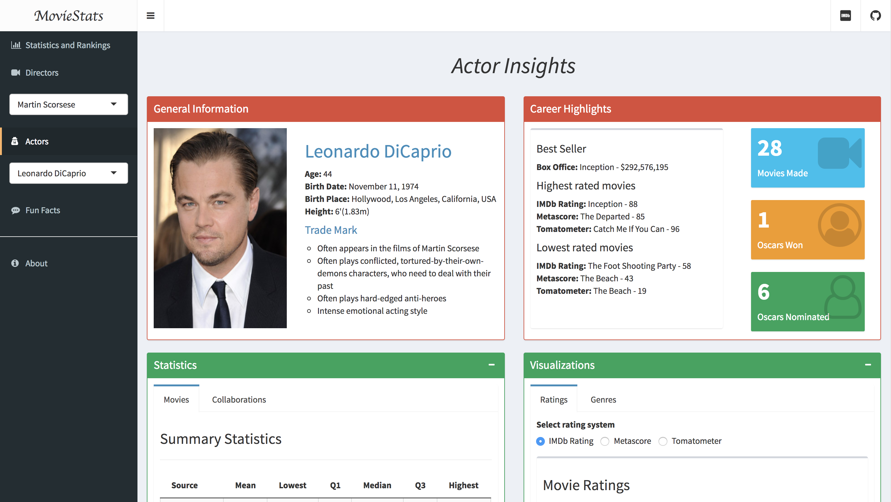
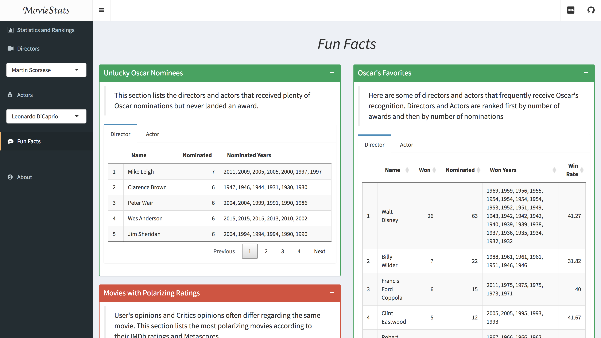

## Overview

This is an interactive web application made with Shiny by Xinghui Song, a Stats Master's student at University of Michigan. 
The idea is to create a dashboard that showcases interesting statistics and visualizations about movies, directors and actors.
Hopefully, by looking at these analytics, movie fans can uncover mildly interesting insights that they normally wouldn't realize
just by seeing the raw information on websites like IMDb. 

Aside from this page, this web app has four main components. 

The **Statistics and Rankings** page has two tabs. The **Visualizations** tab displays some visualizations on the distribution
of ratings of all movies from the data sources. Different plots are created for three rating systems: IMDb rating, Metascore from
Metacritics and Tomatometer from Rotten Tomatoes. The **Director/Actor Rankings** tab shows top actors and directors based on their
average movie ratings. The three rating systems are also available for these rankings. On the left side of this page is a few filtering
criteria determining which movies, actors or directors to be included in the output.

The **Directors** page contains general information and statistics of over 10,000 directors. You can find a director by type in and select
his/her name in the search box right under the "Directors" tab in the side menu. Make sure you click on the tab to see the results as the search
box doesn't automatically direct you there. The **Actors** page functions in the exact same way, only that it displays information of individual actors.

The **Fun Facts** page showcases some of the interesting facts buried beneath the data. Currently it covers topics like Oscar's award records and
polarizing movies. More items will be added further down the line.

Most plots and tables in these pages are interactive. Interactive plots are powered by Plotly. Hover your mouse over the plots to see additional
information as well as possible actions like zooming in. Interactive tables are powered by jQuery DataTable library. Filter options can be applied
to the table through search boxes. You can also sort the tables by columns. 

Note that at the moment, some of the pages can take a little while to render. So you might want to wait a moment before jumping to another
page. I will keep optimizing my codes to make sure the data processing is as fast as possible.

## Data Sources

The collection of movies in this web app is from [MovieLens 20M Dataset](https://grouplens.org/datasets/movielens/20m/). The dataset
contains the titles, genres, and IMDb IDs of close to 30,000 movies.

Another data source is the [OMDb API](http://www.omdbapi.com/). By supplying the IMDb ID of a movie, the API can return a wide range
of information about that movie, including its year of release, director, actors, ratings and box office (though often missing).

Finally, some of the general information on **Directors** page and **Actors** page are scraped from [IMDb](http://www.imdb.com/) using
package `rvest`

## Packages

 + `shinydashboard`: The entire web app is built around the ui elements and layout options provided by this package.
 + `tidyverse`: My go-to collection of packages for data cleaning, manipulation and visualizations.
 + `rvest`: A package for web scraping in R.
 + `plotly`:It provides a `ggplotly` function that can convert plots created from `ggplot` to plotly objects. Works right out of the box most of the times.
 + `DT`: An R interface to jQuery DataTable library. Creates interactive tables.
 + `formattable`: Enables conditional formatting for R tables, similar to the conditional formatting in Microsoft Excel.
 
## Issues and TODOs

 + Some pages can take a while to load. Especially the rankings.
 + The OMDb API only lists the top 4 actors for each movie. Need to get more actors from IMDb.
 + The "Best Seller" movie in director/actor pages may not be accurate since the box office of many movies are not available in the dataset. May need to scrape this information from IMDb movie pages.
 + Figure out how to make the Box Office sort properly on Directors/Actors pages.(formattable doesn't work either)
